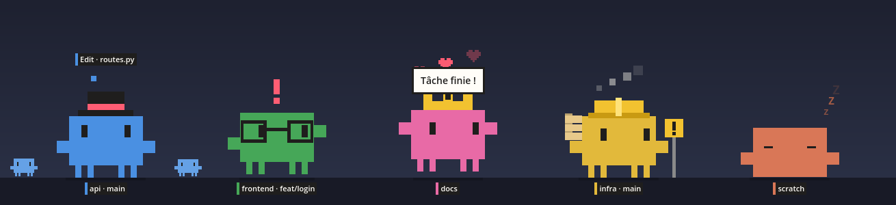

# Paros

[English](README.md) · **Français**

Compagnon de bureau pour Claude Code. Un petit personnage en pixels vit au bas de l'écran, un par session Claude Code ouverte. Un coup d'œil suffit pour savoir ce que fait chaque session : elle travaille, elle attend une réponse, elle a fini.



Godot 4.7, GDScript. Aucun fichier image ni son : tout est dessiné et synthétisé par le code.

> Paros est un projet de fan non officiel. Il n'est ni affilié à Anthropic ni approuvé par Anthropic.

## Ce qu'il fait

- **Un personnage par session.** Il porte le nom de la session (`/rename`) et la branche git sous ses pieds, prend la couleur de la session (`/color`) et a son propre accessoire.
- **Il montre l'état de la session.** Il réfléchit quand Claude travaille, avec l'outil en cours au-dessus de la tête. Il agite les bras quand Claude attend une permission ou une réponse. Il saute quand le tour est fini.
- **Il réagit à ton travail.** Tests verts ou rouges, commandes échouées, sous-agents, contexte plein, modifications non commitées, fusion en cours, commit propre.
- **Il vit sur le bureau.** Il traverse les écrans, s'assoit, dort la nuit, salue les autres personnages, se laisse lancer, grimpe sur la fenêtre active.
- **Il ne gêne pas.** Un clic à côté de lui le traverse. Il quitte l'écran d'une application en plein écran.


| Fiche au survol | Les sessions au repos s'empilent | Réglages |
|---|---|---|
|  |  |  |

## Démarrage rapide

```sh
git clone https://github.com/Dr1mS/Paros.git
cd Paros
export GODOT_PATH=/chemin/vers/godot    # Godot 4.7 ou plus récent
./run.sh
```

Pour quitter : clic droit sur un personnage, puis « Quitter ».

Trois étapes facultatives complètent l'installation :

1. **Hooks Claude Code**, pour les bulles et les réactions aux outils : voir [Claude Code](docs/fr/claude-code.md#installer-les-hooks).
2. **Extension GNOME Shell**, pour le focus du terminal, le perchoir, l'écran de verrouillage et le plein écran : `./gnome-extension/install.sh`, puis se déconnecter et se reconnecter. Voir [Extension GNOME](docs/fr/extension-gnome.md).
3. **Lancement à l'ouverture de session** : « Réglages… », cocher « Lancer au démarrage ».

Sans elles, les personnages suivent quand même les sessions, leur nom, leur couleur et leur état.

Pour lancer sans Godot, construire un binaire autonome avec `./build.sh` (voir [Développement](docs/fr/developpement.md#exporter-en-binaire)).

## Gestes

| Geste | Effet |
|---|---|
| Clic | Le personnage saute de joie |
| Double-clic | Met le terminal de sa session au premier plan |
| Glisser | Le porter. Lâché avec élan, il vole et rebondit |
| Survol | Fiche de la session |
| Déposer un fichier dessus | Copie le chemin dans le presse-papiers |
| Clic droit | Menu : terminal, minuteur de focus, réglages, quitter |

## Documentation

| Guide | Contenu |
|---|---|
| [Utilisation](docs/fr/utilisation.md) | Tous les comportements, les gestes, le menu, les réglages |
| [Claude Code](docs/fr/claude-code.md) | Ce que Paros lit des sessions, installation des hooks, confidentialité |
| [Extension GNOME](docs/fr/extension-gnome.md) | Focus du terminal, perchoir, écran de verrouillage, plein écran |
| [Architecture](docs/fr/architecture.md) | Organisation du code, référence des événements, comment ajouter un sens ou un comportement |
| [Développement](docs/fr/developpement.md) | Tests, export en binaire, performances, limites connues, dépannage |

## Plateformes

| | État |
|---|---|
| Linux, GNOME, Wayland | Testé |
| Linux, autre bureau | Le cœur fonctionne. Les parties propres à GNOME restent muettes |
| Windows | Un binaire est produit, jamais testé |

## Tests

```sh
./test.sh
```

76 tests unitaires, sans affichage, en quelques secondes.
