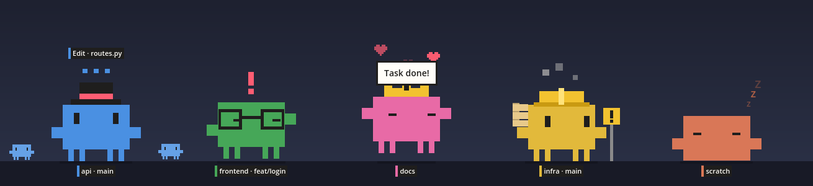

# Paros

**English** · [Français](README.fr.md)

A desktop companion for Claude Code. A small pixel pet lives at the bottom of your screen, one per open Claude Code session. One look tells you what each session is doing: working, waiting for you, or done.



Built with Godot 4.7 and GDScript. No image file and no sound file: everything is drawn and synthesized by code.

> Paros is an unofficial fan project. It is not affiliated with or endorsed by Anthropic.

## What it does

- **One pet per session.** It carries the session name (`/rename`) and git branch under its feet, takes the session color (`/color`), and wears its own accessory.
- **It shows the session state.** Thinking while Claude works, with the tool in use above its head. Waving its arms when Claude waits for a permission or an answer. Jumping when the turn is over.
- **It reacts to your work.** Green or red tests, failed commands, subagents, a full context window, uncommitted changes, a merge in progress, a clean commit.
- **It lives on your desktop.** It walks across your screens, sits, sleeps at night, greets the other pets, can be thrown around, and climbs onto the focused window.
- **It stays out of the way.** Clicks next to it go through. It leaves a screen that runs a full screen app.


| Hover card | Resting sessions stack up | Settings |
|---|---|---|
|  |  |  |

The interface (bubbles, menu, settings) is in English or in French. It follows the language of the system, and can be set in the settings.

## Music

While a media player plays, the pets groove a little: they nod on the beat, lean from side to side, and a small note rises beside their head. Only while they stand, sit or think, so it never hides what a session is doing.

Paros asks the players through MPRIS, which Spotify, VLC and the browsers speak. It needs `gdbus`, present on most Linux desktops. A video that plays in a browser counts as music. To turn it off: "Settings…", untick "Groove to the music".

## Quick start

```sh
git clone https://github.com/Dr1mS/Paros.git
cd Paros
export GODOT_PATH=/path/to/godot    # Godot 4.7 or later
./run.sh
```

Right-click a pet, then "Quit", to quit.

Three optional steps complete the setup:

1. **Claude Code hooks**, for the bubbles and the reactions to tools: see [Claude Code](docs/en/claude-code.md#installing-the-hooks).
2. **GNOME Shell extension**, for the terminal focus, the perch, the lock screen and full screen apps: `./gnome-extension/install.sh`, then log out and back in. See [GNOME extension](docs/en/gnome-extension.md).
3. **Start at login**: "Settings…", tick "Start at login".

Without them, the pets still follow the sessions, their name, their color and their state.

To run without Godot, build a standalone binary with `./build.sh` (see [Development](docs/en/development.md#exporting-a-binary)).

## Controls

| Gesture | Effect |
|---|---|
| Click | The pet cheers |
| Double-click | Brings the terminal of its session to the front |
| Drag | Carry it. Let go with a swing and it flies and bounces |
| Hover | Session card |
| Drop a file on it | Copies the path to the clipboard |
| Right-click | Menu: terminal, focus timer, settings, quit |

## Documentation

| Guide | Content |
|---|---|
| [Usage](docs/en/usage.md) | Every behavior, gesture, menu entry and setting |
| [Claude Code](docs/en/claude-code.md) | What Paros reads from the sessions, hook setup, privacy |
| [GNOME extension](docs/en/gnome-extension.md) | Terminal focus, perch, lock screen, full screen |
| [Architecture](docs/en/architecture.md) | Code layout, event reference, how to add a sense or a behavior |
| [Development](docs/en/development.md) | Tests, binary export, performance, known limits, troubleshooting |

## Platforms

| | Status |
|---|---|
| Linux, GNOME, Wayland | Tested |
| Linux, other desktops | The core works. GNOME-only parts stay silent |
| Windows | A binary is built, never tested |

## Tests

```sh
./test.sh
```

83 unit tests, run without a display in a few seconds.

## License

[MIT](LICENSE). The license covers the code of this repository. The character drawn by Paros is modeled on the Claude Code mascot, which belongs to Anthropic.
