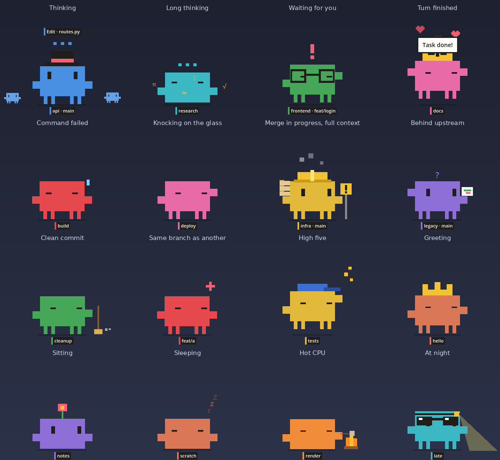
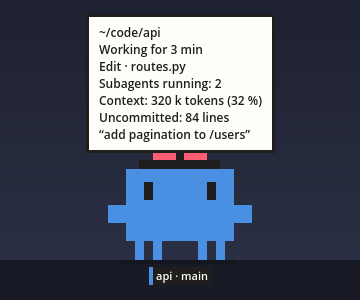
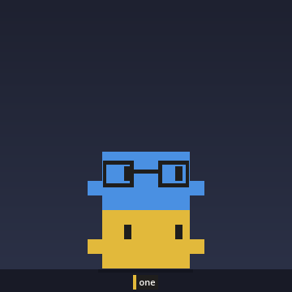
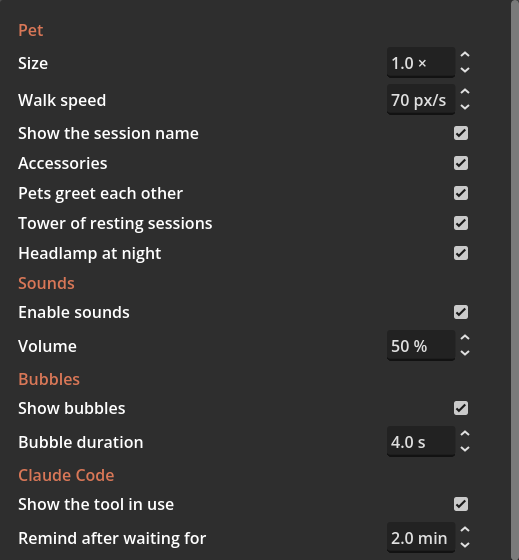

# Usage

[Français](../fr/utilisation.md)

The interface is in English or in French. It follows the language of the system, and can be set at the bottom of the settings. Texts are quoted here in English.

## The pets

Each interactive Claude Code session open on the machine has its pet. It appears when the session opens and goes when it closes, without restarting Paros. With no session, a single orange pet with no name walks around.

| What tells a pet apart | Where it comes from |
|---|---|
| Name under its feet | Session name (`/rename`), followed by the git branch of the folder |
| Color | Session color (`/color`). No color chosen: orange |
| Accessory | Derived from the session name, so a session always gets the same one: top hat, crown, cap, bow, glasses, flower, or none |

## Gestures

| Gesture | Effect |
|---|---|
| Click | The pet cheers |
| Double-click | Brings the terminal of its session to the front and rings its tab. Needs the [GNOME extension](gnome-extension.md) |
| Drag | Carry it. Let go with a swing and it flies and bounces off the edges and the floor. Dropped from high up, it opens an umbrella |
| Hover | Its eyes follow the mouse. A card shows the folder, the session state and how long it has lasted, the tool in use, the number of subagents, the context tokens, the git status, the last prompt, the focus time left |
| Drop a file on it | Copies the path to the clipboard, ready to paste into the terminal |
| Right-click | Menu |

A click next to the pet goes through its window and reaches what is behind.

## Right-click menu

| Entry | Effect |
|---|---|
| Go to its terminal | Same as a double-click |
| Ring its terminal | Sends a bell to the terminal of the session: its tab gets a mark |
| Start a focus | Starts the timer. The entry becomes "Stop the focus" and shows the time left |
| Settings… | Opens the settings window |
| Quit | Closes Paros and every pet |

The first two entries exist only for a pet tied to a session.

## What a pet does by itself

| Behavior | When |
|---|---|
| Walks, turns around at the edges | At rest. It crosses every screen placed side by side |
| Sits, looks around | At rest, now and then |
| Sleeps | At night (11 pm to 7 am), and after 5 minutes without keyboard or mouse activity |
| Stretches | When it wakes up |
| Strolls or trots | Follows the load average of the machine: slow when nothing runs, fast when every core is busy |
| Headlamp | At night, when it is awake |
| Greets | When it meets another pet. Both walk away afterwards |
| Glares | When it meets a pet whose session works in the same folder and on the same branch |
| High five | When its neighbor and itself both just succeeded (end of turn or green tests, within 20 seconds and 200 pixels) |
| Stacks up | When at least two sessions have been at rest for 90 seconds, their pets gather and sit on each other. The tower falls as soon as one of these sessions gets a prompt, or a pet is grabbed |
| Campfire | CPU at 92 °C or more, or every core busy for a minute: it sits down and roasts a marshmallow. At most once every 10 minutes |

The behaviors tied to the session state (thinking, alert, subagents, tests, git) are described in [Claude Code](claude-code.md). Those that need the GNOME extension (perch, sleeping by the pointer, lock screen, full screen) in [GNOME extension](gnome-extension.md).

## Focus

Right-click, "Start a focus": 25 minutes of work, then a 5 minute break. The pets announce the start of the focus, the start of the break and its end. The time left shows in the menu and in the hover card. The timer is shared by every pet.

## Sounds

| Sound | When |
|---|---|
| Two rising notes | End of turn, green tests |
| Two falling notes, the last one dissonant | Failed command or failed tests |
| Short puff | Landing after a throw |
| Two dull knocks | Knocking on the screen edge |

On Linux, sounds are played by `pw-play`, `paplay` or `aplay`, the first one found. With none of them, Paros is silent.

## Bubbles

A pet speaks in bubbles: "Task done!", "Green tests!", "Red tests", the permission request of Claude, a reminder when the wait gets long, the focus announcements, "Low battery". A bubble stays 4 seconds.

## Settings

Right-click, "Settings…". Each change applies and is saved at once. Settings are stored in `~/.local/share/paros/settings.cfg`.

### Pet

| Setting | Default | Key | Effect |
|---|---|---|---|
| Size | 1.0 × | `pet/size` | Size of the pet, its name tag and its bubbles. From 0.5 to 3 |
| Walk speed | 70 px/s | `pet/walk_speed` | Base speed, before the effect of the load and of the folders carried |
| Show the session name | yes | `pet/show_name` | Name tag under the feet |
| Accessories | yes | `pet/accessories` | Hats and the like. The hard hat always shows |
| Pets greet each other | yes | `pet/greetings` | Greetings and glares between pets that meet |
| Tower of resting sessions | yes | `pet/tower` | Stacking of resting pets |
| Headlamp at night | yes | `pet/headlamp` | |

### Sounds

| Setting | Default | Key |
|---|---|---|
| Enable sounds | yes | `sound/enabled` |
| Volume | 50 % | `sound/volume` |

### Bubbles

| Setting | Default | Key |
|---|---|---|
| Show bubbles | yes | `bubble/enabled` |
| Bubble duration | 4 s | `bubble/seconds` |

### Claude Code

| Setting | Default | Key | Effect |
|---|---|---|---|
| Show the tool in use | yes | `claude/show_activity` | Caption above the head while working |
| Remind after waiting for | 2 min | `claude/nag_minutes` | Delay before the reminder of a waiting session |
| Knock when the terminal is not focused | yes | `claude/knock` | Knocking on the screen edge |
| Model context, in thousands of tokens | 1000 k | `claude/context_window_k` | Size of the context window of the model. Used to know when the head smokes |
| Follow the git status of folders | yes | `git/enabled` | Runs `git` every 10 seconds in the folder of each session |

### Desktop (GNOME extension)

| Setting | Default | Key |
|---|---|---|
| Climb onto the focused window | yes | `desktop/perch` |
| Sleep by the still pointer | yes | `desktop/cuddle` |
| Leave the screen of a full screen app | yes | `desktop/leave_fullscreen` |
| Screen on after locking | 10 min | `desktop/lock_screen_minutes` |

### Sleep

| Setting | Default | Key |
|---|---|---|
| Night starts at | 23 h | `sleep/night_start_hour` |
| Night ends at | 7 h | `sleep/night_end_hour` |
| Sleep after inactivity | 5 min | `sleep/idle_minutes` |

User inactivity is read from GNOME. On another desktop, only the night sleep exists.

### Focus

| Setting | Default | Key |
|---|---|---|
| Focus duration | 25 min | `focus/minutes` |
| Break duration | 5 min | `focus/break_minutes` |

### System

| Setting | Default | Key | Effect |
|---|---|---|---|
| Battery and temperature alerts | yes | `system/alerts` | Campfire and low battery bubble |
| Start at login | no | none | Creates or removes `~/.config/autostart/paros.desktop`. The entry points to the program that runs when the box is ticked: the binary, or Godot with the project folder |

Note: the mouse wheel over a number field changes its value. To scroll the window, put the pointer on a label or on the scroll bar.

### Language

| Setting | Default | Key | Effect |
|---|---|---|---|
| Language | Automatic | `interface/language` | `auto`: language of the system, French if it is French, English otherwise. Or `en`, `fr` |
