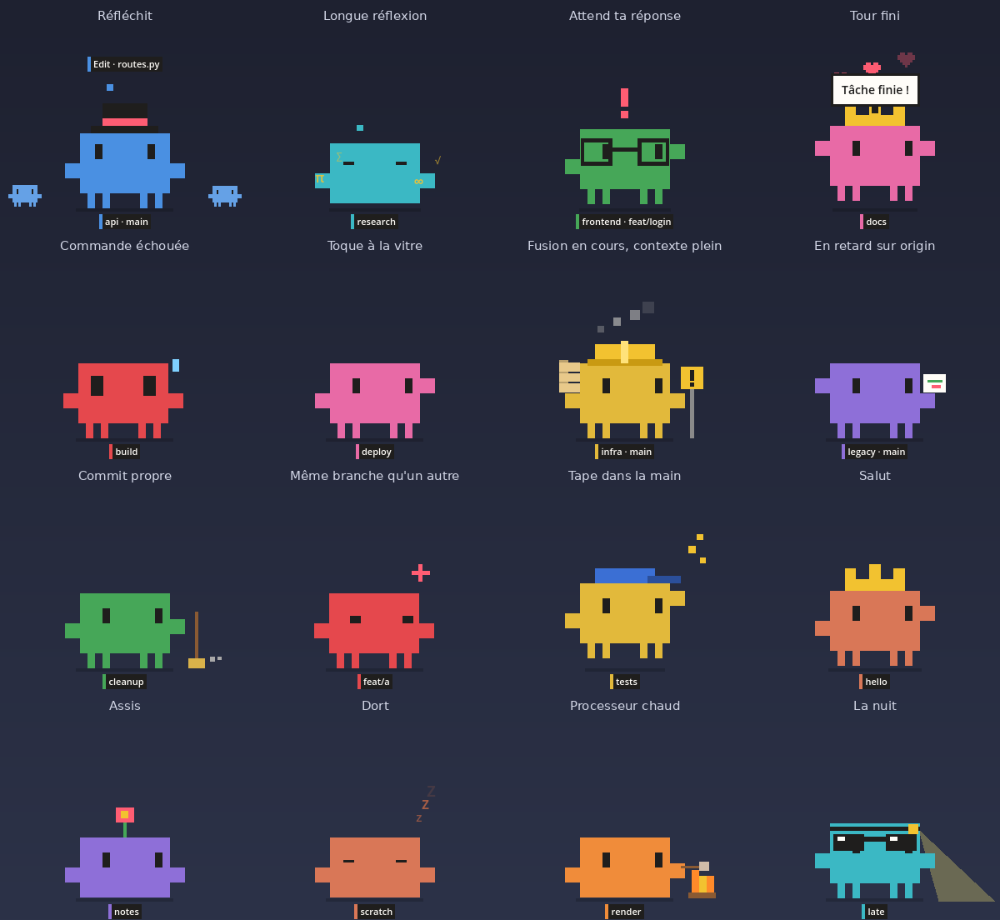
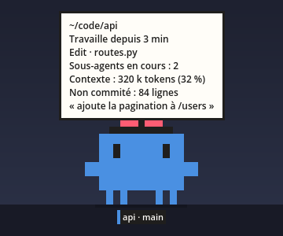
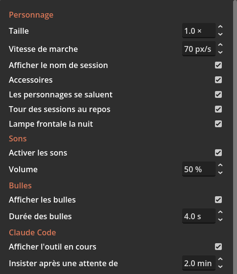

# Utilisation

[English](../en/usage.md)

## Les personnages

Chaque session Claude Code interactive ouverte sur la machine a son personnage. Il apparaît à l'ouverture de la session et disparaît à sa fermeture, sans relancer Paros. Sans aucune session, un seul personnage orange, sans nom, se promène.

| Ce qui distingue un personnage | D'où ça vient |
|---|---|
| Nom sous ses pieds | Nom de la session (`/rename`), suivi de la branche git du dossier |
| Couleur | Couleur de la session (`/color`). Sans couleur choisie : orange |
| Accessoire | Tiré du nom de la session, donc toujours le même pour une session : haut-de-forme, couronne, casquette, nœud, lunettes, fleur, ou rien |

## Gestes

| Geste | Effet |
|---|---|
| Clic gauche | Le personnage saute de joie |
| Double-clic | Met le terminal de sa session au premier plan et fait sonner son onglet. Demande l'[extension GNOME](extension-gnome.md) |
| Glisser | Le porter. Lâché avec élan, il vole et rebondit sur les bords et le sol. Lâché de haut, il ouvre un parapluie |
| Survol | Ses yeux suivent la souris. Une fiche affiche le dossier, l'état de la session et sa durée, l'outil en cours, le nombre de sous-agents, les tokens de contexte, l'état git, le dernier prompt, le temps de focus restant |
| Déposer un fichier dessus | Copie le chemin dans le presse-papiers, prêt à coller dans le terminal |
| Clic droit | Menu |

Un clic à côté du personnage traverse sa fenêtre et atteint ce qui est derrière.

## Menu du clic droit

| Entrée | Effet |
|---|---|
| Aller à son terminal | Comme le double-clic |
| Faire sonner son terminal | Envoie une sonnerie au terminal de la session : son onglet est marqué |
| Démarrer un focus | Lance le minuteur. L'entrée devient « Arrêter le focus » et affiche le temps restant |
| Réglages… | Ouvre la fenêtre de réglages |
| Quitter | Ferme Paros et tous les personnages |

Les deux premières entrées n'existent que pour un personnage lié à une session.

## Ce que fait un personnage de lui-même

| Comportement | Quand |
|---|---|
| Marche, fait demi-tour aux bords | Au repos. Il traverse tous les écrans placés côte à côte |
| S'assoit, regarde autour de lui | Au repos, de temps en temps |
| Dort | La nuit (23 h à 7 h), et après 5 minutes sans activité clavier ni souris |
| S'étire | Au réveil |
| Flâne ou trottine | Selon la charge moyenne de la machine : lent quand rien ne tourne, rapide quand tous les cœurs sont occupés |
| Lampe frontale | La nuit, quand il est éveillé |
| Salue | Quand il croise un autre personnage. Les deux s'éloignent ensuite |
| Toise | Quand il croise un personnage dont la session travaille dans le même dossier et la même branche |
| Tape dans la main | Quand son voisin et lui viennent tous deux de réussir (fin de tour ou tests verts, à moins de 20 secondes et 200 pixels) |
| S'empile | Quand au moins deux sessions sont au repos depuis 90 secondes : leurs personnages se rejoignent et s'assoient l'un sur l'autre. La tour s'écroule dès qu'une de ces sessions reçoit un prompt, ou qu'un personnage est attrapé |
| Feu de camp | Processeur à 92 °C ou plus, ou tous les cœurs occupés depuis une minute : il s'assoit et fait griller une guimauve. Au plus une fois toutes les 10 minutes |

Les comportements liés à l'état des sessions (réflexion, alerte, sous-agents, tests, git) sont décrits dans [Claude Code](claude-code.md). Ceux qui demandent l'extension GNOME (perchoir, sommeil contre le curseur, écran de verrouillage, plein écran) dans [Extension GNOME](extension-gnome.md).

## Focus

Clic droit, « Démarrer un focus » : 25 minutes de travail, puis 5 minutes de pause. Les personnages annoncent le début du focus, le début de la pause et sa fin. Le temps restant se lit dans le menu et dans la fiche au survol. Le minuteur est commun à tous les personnages.

## Sons

| Son | Quand |
|---|---|
| Deux notes montantes | Fin de tour, tests verts |
| Deux notes descendantes, la dernière dissonante | Commande ou tests échoués |
| Souffle court | Retombée au sol après un lancer |
| Deux coups sourds | Toc-toc sur le bord de l'écran |

Sous Linux, les sons passent par `pw-play`, `paplay` ou `aplay`, le premier trouvé. Sans aucun des trois, Paros est muet.

## Bulles

Un personnage parle par bulles : « Tâche finie ! », « Tests verts ! », « Tests rouges », la demande de permission de Claude, un rappel quand l'attente dure, les annonces du focus, « Batterie faible ». Une bulle reste 4 secondes.

## Réglages

Clic droit, « Réglages… ». Chaque changement s'applique et s'enregistre tout de suite. Les réglages sont stockés dans `~/.local/share/paros/settings.cfg`.

### Personnage

| Réglage | Défaut | Clé | Effet |
|---|---|---|---|
| Taille | 1.0 × | `pet/size` | Taille du personnage, de son étiquette et de ses bulles. De 0.5 à 3 |
| Vitesse de marche | 70 px/s | `pet/walk_speed` | Vitesse de base, avant l'effet de la charge et des dossiers portés |
| Afficher le nom de session | oui | `pet/show_name` | Étiquette sous les pieds |
| Accessoires | oui | `pet/accessories` | Chapeaux et autres. Le casque de chantier reste affiché |
| Les personnages se saluent | oui | `pet/greetings` | Saluts et regards entre personnages qui se croisent |
| Tour des sessions au repos | oui | `pet/tower` | Empilement des personnages au repos |
| Lampe frontale la nuit | oui | `pet/headlamp` | |

### Sons

| Réglage | Défaut | Clé |
|---|---|---|
| Activer les sons | oui | `sound/enabled` |
| Volume | 50 % | `sound/volume` |

### Bulles

| Réglage | Défaut | Clé |
|---|---|---|
| Afficher les bulles | oui | `bubble/enabled` |
| Durée des bulles | 4 s | `bubble/seconds` |

### Claude Code

| Réglage | Défaut | Clé | Effet |
|---|---|---|---|
| Afficher l'outil en cours | oui | `claude/show_activity` | Légende au-dessus de la tête pendant le travail |
| Insister après une attente de | 2 min | `claude/nag_minutes` | Délai avant le rappel d'une session qui attend |
| Toquer quand le terminal n'a pas le focus | oui | `claude/knock` | Toc-toc au bord de l'écran |
| Contexte du modèle, en milliers de tokens | 1000 k | `claude/context_window_k` | Taille de la fenêtre de contexte du modèle. Sert à savoir quand la tête fume |
| Suivre l'état git des dossiers | oui | `git/enabled` | Lance `git` toutes les 10 secondes dans le dossier de chaque session |

### Bureau (extension GNOME)

| Réglage | Défaut | Clé |
|---|---|---|
| Grimper sur la fenêtre active | oui | `desktop/perch` |
| Dormir contre le curseur immobile | oui | `desktop/cuddle` |
| Quitter l'écran d'une app en plein écran | oui | `desktop/leave_fullscreen` |
| Écran allumé après verrouillage | 10 min | `desktop/lock_screen_minutes` |

### Sommeil

| Réglage | Défaut | Clé |
|---|---|---|
| Début de la nuit | 23 h | `sleep/night_start_hour` |
| Fin de la nuit | 7 h | `sleep/night_end_hour` |
| Sommeil après inactivité | 5 min | `sleep/idle_minutes` |

L'inactivité est lue auprès de GNOME. Sur un autre bureau, seul le sommeil de nuit existe.

### Focus

| Réglage | Défaut | Clé |
|---|---|---|
| Durée d'un focus | 25 min | `focus/minutes` |
| Durée d'une pause | 5 min | `focus/break_minutes` |

### Système

| Réglage | Défaut | Clé | Effet |
|---|---|---|---|
| Alertes batterie et température | oui | `system/alerts` | Feu de camp et bulle de batterie faible |
| Lancer au démarrage | non | aucune | Crée ou supprime `~/.config/autostart/paros.desktop`. L'entrée pointe vers le programme qui tourne au moment où la case est cochée : le binaire, ou Godot avec le dossier du projet |

Attention : la molette au-dessus d'un champ numérique change sa valeur. Pour faire défiler la fenêtre, placer le curseur sur un libellé ou sur la barre de défilement.
